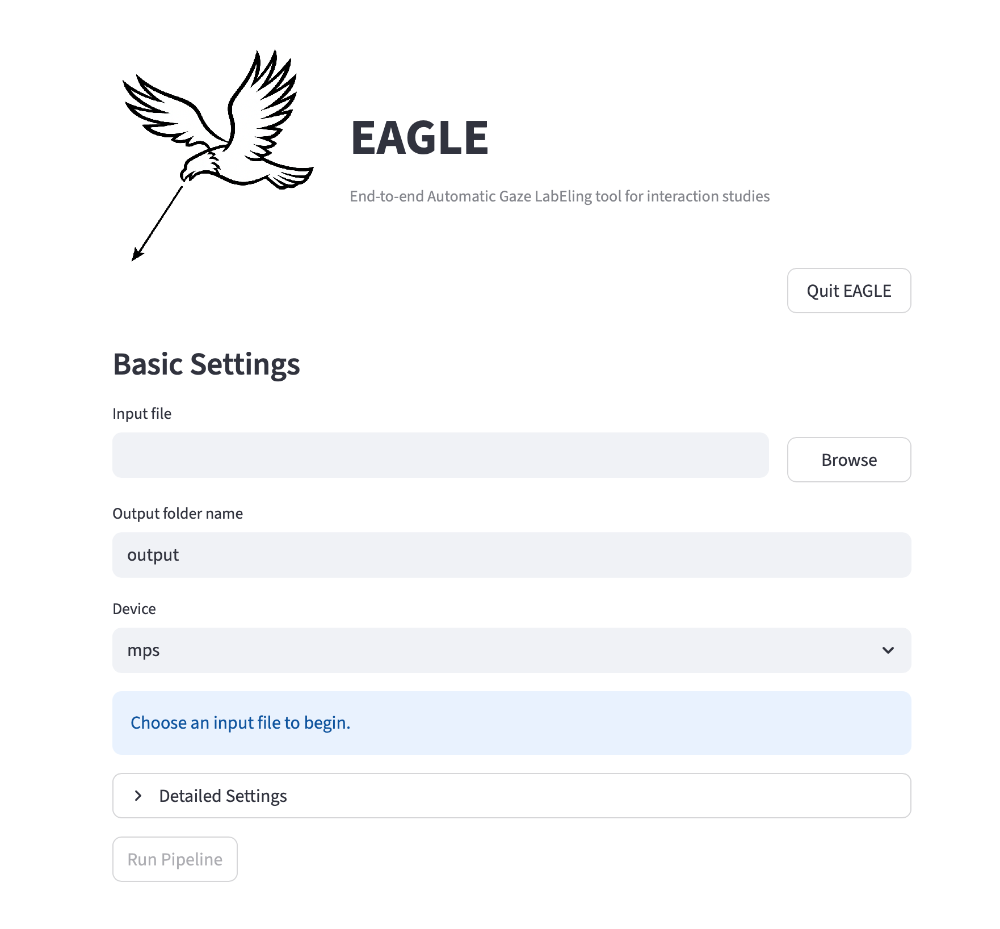

# EAGLE
<p align="center">
  EAGLE: <strong>E</strong>nd-to-end <strong>A</strong>utomatic <strong>G</strong>aze <strong>L</strong>ab<strong>E</strong>ling tool for interaction studies
</p>

<p align="center">
  
</p>

## 言語

- [English](README.md)
- [日本語](README.ja.md)
- [简体中文](README.zh.md)
- [Español](README.es.md)

## 概要
EAGLE は、画像・動画解析向けの Streamlit ベース視線アノテーション支援ツールです。次の処理を組み合わせます。

- YOLO pose による人物追跡
- YOLO detection による非人物オブジェクト追跡
- RetinaFace による顔検出
- GAZELLE による視線ヒートマップ推定
- MobileOne gaze による画面外方向推定
- CSV 出力と、注釈付き画像・動画の出力

EAGLE はアノテーション支援ツールであり、正解データを保証するものではありません。研究、分析、報告、意思決定に使用する前に、すべての出力を必ず確認・検証してください。

## 出力例
<p align="center">
  
  
  
</p>

## GUI例
<p align="center">
  
</p>

## 現在のシステムでできること
入力画像または動画ごとに、現在のパイプラインは次を実行できます。

- pose 検出から人物を検出・追跡する
- すべての COCO オブジェクトクラスを保持する、または選択したクラスだけを保持する
- 追跡中の人物ごとに顔を 1 つ検出する
- 視線ヒートマップと視線点を推定する
- `left`、`up right`、`down`、`front` などの画面外方向ラベルを推定する（人物中心の向き）
- `annotation.csv` に ELAN 風の視線区間を生成する
- 設定が一致する場合、キャッシュ済みの `objects.csv` と視線出力を再利用する
- アプリが設定不一致を検出した場合でも、古いキャッシュを強制再利用する

人物検出では、EAGLE は pose keypoint も使い、可能な場合は視線を face、head、torso、arms、legs などの身体部位に割り当てます。

## 対応入力
- 画像: `.jpg`, `.jpeg`, `.png`, `.bmp`, `.tif`, `.tiff`, `.webp`
- 動画: `.mp4`, `.mov`, `.avi`, `.mkv`, `.m4v`, `.wmv`, `.webm`

## 現在の実行環境メモ
- macOS では、`Browse` が `osascript` 経由でネイティブのファイルダイアログを開きます。
- Linux（Docker を含む）では、`Container File Browser` を使うか、マウント済みパスを手入力します。
- コアパイプライン自体は [`eagle/`](eagle/) 以下の通常の Python コードです。
- macOS と Windows 用の FFmpeg バイナリを同梱しています。
- モデルファイルは `~/.EAGLE/` にキャッシュされます。

## ダウンロード
ビルド済みアプリバンドルは GitHub Releases から取得できます。

- https://github.com/Taiga-Mori/EAGLE/releases

## セットアップ
仮想環境を作成して依存関係をインストールします。

```bash
python -m venv venv
source venv/bin/activate
pip install -r requirements.txt
```

推奨 Python バージョン: `3.10`

## アプリの起動
推奨:

```bash
python app.py
```

このランチャーは Streamlit を起動し、ブラウザでアプリを開きます。ポート `8501` が使えない場合は、近いポートを自動的に試します。

Streamlit を直接起動することもできます。

```bash
venv/bin/streamlit run app.py
```

## 初回起動とモデルダウンロード
初回利用時、EAGLE は必要に応じて次をダウンロードしてキャッシュします。

- `yolo26x.pt`
- `yolo26x-pose.pt`
- RetinaFace の学習済み重み
- GAZELLE の torch.hub ファイル
- `mobileone_s0.pt`

初回ロードに失敗した場合は、次を確認してください。

- マシンがオンラインであること
- GitHub / モデル配布エンドポイントに到達できること
- 現在のユーザーが `~/.EAGLE/` に書き込めること

## アプリのワークフロー
1. `python app.py` でアプリを起動します。
2. `Input file` を設定します。
   - macOS: `Browse` をクリックします。
   - Linux/Docker: `Container File Browser` を使うか、マウント済みパスを入力します。
3. 入力画像または動画を 1 つ選択します。
4. 検出されたメディア種別を確認します。
5. 必要に応じて `Output folder name` を編集します。
6. 必要に応じて `Detailed Settings` を開きます。
7. `Run Pipeline` をクリックします。
8. 最後に表示される出力パスを確認します。

出力ディレクトリの挙動:

- 入力ディレクトリに書き込み可能な場合、出力先の親ディレクトリは入力ファイルの親と同じです。
- 入力ディレクトリが読み取り専用の場合（Docker の `:ro` マウントでよくあります）、出力先は `/app/output/<input_stem>` にフォールバックします。
- デフォルトの出力フォルダ名は入力ファイルの stem です。
- 例:
  - 入力: `/data/session01/test.mp4`
  - 書き込み可能な親: `/data/session01/test`
  - 読み取り専用親のフォールバック: `/app/output/test`

## 主な設定

### Basic Settings
- `Input file`
  - macOS: `Browse` によってセットされる読み取り専用欄です。
  - Linux/Docker: 編集可能な欄です（手入力でパス指定できます）。
- `Output folder name`
  - 入力ファイルの隣に作られるフォルダ名です。
- `Device`
  - NVIDIA GPU が複数ある場合は `cuda:0`, `cuda:1`, ... を使います（それ以外は `mps` または `cpu`）。

### Inference
- `Detection threshold`
  - オブジェクトのフィルタリング、顔のフィルタリング、視線 in/out 解釈に共通で使うしきい値です。
- `Visualization mode`
  - `both`, `point`, `heatmap`
- `Heatmap alpha`
  - ヒートマップ出力の重ね合わせ強度です。
- `Gaze target radius (px)`
  - `0` は点のみでターゲット割り当てを行います。大きい値では視線点の周囲円を使います。
- `Person part distance scale`
  - 視線が人物の keypoint からどれくらい離れていても身体部位として扱うかを制御します。
- `Reuse existing objects.csv when available`
  - メタデータが現在の実行と一致する場合、キャッシュ済みの物体検出を再利用します。
- `Reuse existing gaze.csv and heatmaps.npz when available`
  - メタデータが現在の実行と一致する場合、キャッシュ済みの視線出力を再利用します。
- `Track all object classes`
  - オフにすると、保持する COCO クラスを明示的に選択できます。

### Temporal Settings
- `Object smoothing window`
  - 追跡オブジェクトの bbox に対する平滑化窓です。
- `Gaze smoothing window`
  - 視線推定と画面外方向角度に対する平滑化窓です。
- `Object frame interval`
  - 動画のみ。オブジェクト検出・追跡を N フレームごとに実行します。
- `Gaze frame interval`
  - 動画のみ。視線推定を N フレームごとに実行し、その後補間・平滑化します。

重要:

- `Gaze frame interval` は `Object frame interval` より小さくできます。Object track は検出フレーム間で線形補間され、動画出力は元動画の FPS で描画されます。
- 内部的には、動画設定は元動画の FPS から target FPS 値に変換されます。

### BoT-SORT
UI では [`config/botsort.yaml`](config/botsort.yaml) の以下の tracker 設定を変更できます。

- `track_high_thresh`
- `track_low_thresh`
- `new_track_thresh`
- `track_buffer`
- `match_thresh`
- `Enable ReID`
- `proximity_thresh`
- `appearance_thresh`

## キャッシュの挙動
EAGLE はキャッシュ再利用前に確認するメタデータファイルを書き出します。

- `objects.csv` と `.objects_meta.json`
- `gaze.csv` と `gaze_heatmaps.npz` と `.gaze_meta.json`

Object cache の再利用は次に依存します。

- 入力ファイルパス
- 入力ファイルのタイムスタンプ
- Detection threshold
- Object frame interval
- Object smoothing window
- 選択されたオブジェクトクラス
- BoT-SORT 設定
- 現在の pose ベース人物追跡形式で作成されたキャッシュかどうか

Gaze cache の再利用は次に依存します。

- 入力ファイルパス
- 入力ファイルのタイムスタンプ
- Detection threshold
- Gaze frame interval
- Gaze smoothing window
- `objects.csv` のタイムスタンプ

不一致を検出すると、アプリは警告を表示し、`Force reuse` チェックボックスを提示します。

## 出力ファイル
現在の出力には次が含まれます。

- `objects.csv`
  - 平滑化済みのオブジェクト/人物追跡結果
- `.objects_meta.json`
  - object cache 再利用検証用のメタデータ
- `gaze.csv`
  - 顔検出、raw gaze 値、処理済み視線点、画面外方向フィールド
- `gaze_heatmaps.npz`
  - dense な視線ヒートマップのキャッシュ
- `.gaze_meta.json`
  - gaze cache 再利用検証用のメタデータ
- `annotation.csv`
  - ELAN 風の視線区間、または単一画像ラベル
- `all_points.jpg`
  - 画像入力用の point 可視化
- `all_points.mp4`
  - 動画入力用の point 可視化
- `person_<track_id>_heatmap.jpg`
  - 画像入力用の人物別ヒートマップ出力
- `person_<track_id>_heatmap.mp4`
  - 動画入力用の人物別ヒートマップ出力

`temp/` や `heatmaps/` などの一時フォルダは export 後に削除されます。

## CSV の内容
`objects.csv` の列:

- `frame_idx`
- `cls`
- `track_id`
- `source`
- `conf`
- `x1`, `y1`, `x2`, `y2`
- `pose_keypoints`
- `label`

`gaze.csv` の列:

- `frame_idx`
- `track_id`
- `face_detected`
- `face_conf`
- `face_x1`, `face_y1`, `face_x2`, `face_y2`
- `raw_gaze_detected`
- `raw_inout`
- `raw_x_gaze`, `raw_y_gaze`
- `gaze_detected`
- `inout`
- `x_gaze`, `y_gaze`
- `offscreen_direction`
- `offscreen_yaw`
- `offscreen_pitch`

`annotation.csv` の列:

- `tier`
- `start_time`
- `end_time`
- `gaze`

## 開発用エントリポイント
- [`app.py`](app.py)
  - Streamlit UI とランチャー
- [`main.py`](main.py)
  - ローカル用の最小スモークテスト入口
- [`eagle/pipeline.py`](eagle/pipeline.py)
  - メインの Python API facade

最小コード例:

```python
from eagle import EAGLE

eagle = EAGLE()
eagle.preprocess(
    input_path="input.mp4",
    output_dir="output_dir",
    det_thresh=0.5,
    device="cpu",
    visualization_mode="both",
)
results = eagle.run_all()
```

## 検証
基本的な構文検証:

```bash
python -m py_compile main.py app.py eagle/*.py
```

## 免責事項
- このソフトウェアは自己責任で使用してください。
- EAGLE は検出、視線推定、ターゲット割り当て、エクスポートされた注釈の正確性を保証しません。
- 最終的な確認と修正の責任はユーザーにあります。

## ライセンス
このプロジェクトは `AGPL-3.0-or-later` でライセンスされています。リポジトリのライセンス本文は [LICENSE](LICENSE) を参照してください。

## 謝辞
- Ultralytics YOLO
  - https://docs.ultralytics.com/
- BoT-SORT
  - https://github.com/NirAharon/BoT-SORT
- RetinaFace
  - https://github.com/serengil/retinaface
- GAZELLE
  - https://github.com/fkryan/gazelle
- MobileOne gaze-estimation weights
  - https://github.com/yakhyo/gaze-estimation
