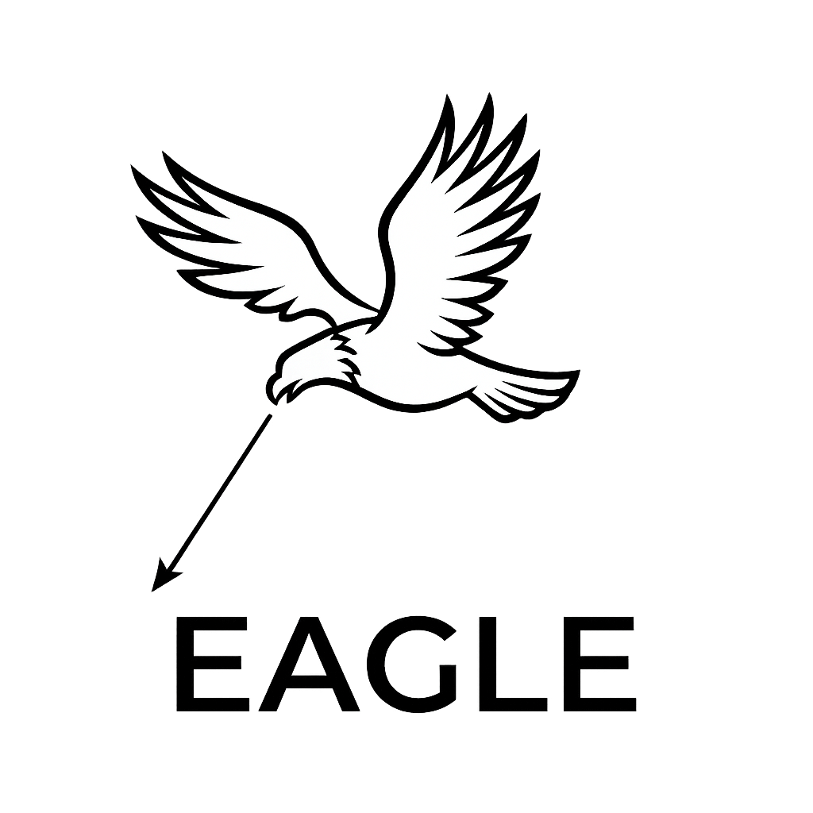
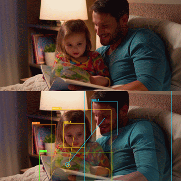
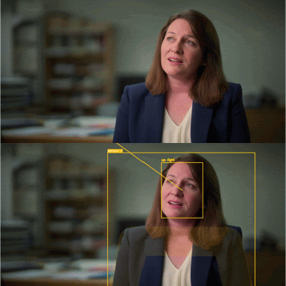
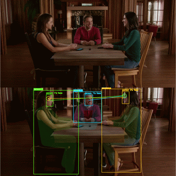

# EAGLE
<p align="center">
  EAGLE: <strong>E</strong>nd-to-end <strong>A</strong>utomatic <strong>G</strong>aze <strong>L</strong>ab<strong>E</strong>ling tool for interaction studies
</p>


<p align="center">
  
</p>

## English

### Overview
EAGLE is a Streamlit-based gaze annotation support tool for image and video analysis. It combines:

- Person tracking with YOLO pose
- Non-person object tracking with YOLO detection
- Face detection with RetinaFace
- Gaze heatmap estimation with GAZELLE
- Off-screen direction estimation with MobileOne gaze
- CSV export plus annotated image/video export

EAGLE is an annotation assistance tool, not guaranteed ground truth. You must review and validate all outputs before using them in research, analysis, reporting, or decision-making.

### Example Outputs
<p align="center">
  
  
  
</p>

### What The Current System Does
For each input image or video, the current pipeline can:

- Detect and track persons from pose detections
- Optionally keep all COCO object classes or only selected classes
- Detect one face per tracked person
- Estimate gaze heatmaps and gaze points
- Infer off-screen direction labels such as `left`, `up right`, `down`, or `front` (person-centric orientation)
- Generate ELAN-style gaze segments in `annotation.csv`
- Reuse cached `objects.csv` and cached gaze outputs when settings still match
- Force reuse old caches even when the app detects a settings mismatch

For person detections, EAGLE also uses pose keypoints to assign gaze to body parts such as face, head, torso, arms, or legs when possible.

### Supported Inputs
- Images: `.jpg`, `.jpeg`, `.png`, `.bmp`, `.tif`, `.tiff`, `.webp`
- Videos: `.mp4`, `.mov`, `.avi`, `.mkv`, `.m4v`, `.wmv`, `.webm`

### Current Runtime Notes
- On macOS, `Browse` opens a native file dialog through `osascript`.
- On Linux (including Docker), use `Container File Browser` or enter a mounted path manually.
- The core pipeline itself is regular Python code under [`eagle/`](/Users/taigamori/Works/EAGLE/eagle).
- Bundled FFmpeg binaries are included for macOS and Windows.
- Model files are cached under `~/.EAGLE/`.

### License
This project is licensed under `AGPL-3.0-or-later`.
See [LICENSE](/Users/taigamori/Works/EAGLE/LICENSE) for the repository license text.

### Setup
Create a virtual environment and install dependencies:

```bash
python -m venv venv
source venv/bin/activate
pip install -r requirements.txt
```

### Launching The App
Recommended:

```bash
python app.py
```

This launcher starts Streamlit for you and opens the app in a browser. If port `8501` is unavailable, it tries nearby ports automatically.

You can also run Streamlit directly:

```bash
venv/bin/streamlit run app.py
```

### First Run And Model Download
On first use, EAGLE may download and cache:

- `yolo26x.pt`
- `yolo26x-pose.pt`
- RetinaFace pretrained weights
- GAZELLE torch.hub files
- `mobileone_s0.pt`

If first-run loading fails, check:

- The machine is online
- GitHub / model hosting endpoints are reachable
- The current user can write to `~/.EAGLE/`

### App Workflow
1. Launch the app with `python app.py`.
2. Set `Input file`:
   - macOS: click `Browse`.
   - Linux/Docker: use `Container File Browser` or type a mounted path.
3. Select one input image or video.
4. Confirm the detected media type.
5. Edit `Output folder name` if needed.
6. Optionally open `Detailed Settings`.
7. Click `Run Pipeline`.
8. Review the output paths shown at the end.

Output directory behavior:

- If the input directory is writable, the output parent is the same as the input file's parent.
- If the input directory is read-only (common with `:ro` Docker mounts), the output falls back to `/app/output/<input_stem>`.
- The default output folder name is the input stem.
- Example:
  - Input: `/data/session01/test.mp4`
  - Writable parent: `/data/session01/test`
  - Read-only parent fallback: `/app/output/test`

### Main Settings

#### Basic Settings
- `Input file`
  - macOS: read-only field populated by `Browse`.
  - Linux/Docker: editable field (manual path entry supported).
- `Output folder name`
  - Folder created next to the input file.
- `Device`
  - Uses `cuda:0`, `cuda:1`, ... when multiple NVIDIA GPUs are available (otherwise `mps` or `cpu`).

#### Inference
- `Detection threshold`
  - Shared threshold used for object filtering, face filtering, and gaze in/out interpretation.
- `Visualization mode`
  - `both`, `point`, or `heatmap`
- `Heatmap alpha`
  - Overlay strength for heatmap outputs.
- `Gaze target radius (px)`
  - `0` means point-only target assignment. Larger values use a circular target area.
- `Person part distance scale`
  - Controls how far from a person's keypoints gaze can still count as a body part target.
- `Reuse existing objects.csv when available`
  - Reuses cached object detections when metadata still matches the current run.
- `Reuse existing gaze.csv and heatmaps.npz when available`
  - Reuses cached gaze outputs when metadata still matches the current run.
- `Track all object classes`
  - When off, you can explicitly choose which COCO classes to keep.

#### Temporal Settings
- `Object smoothing window`
  - Smoothing window for tracked object boxes.
- `Gaze smoothing window`
  - Smoothing window for gaze estimates and off-screen direction angles.
- `Object frame interval`
  - For videos only. Object detection/tracking runs every Nth frame.
- `Gaze frame interval`
  - For videos only. Gaze estimation runs every Nth frame and is then interpolated/smoothed.

Important:

- `Gaze frame interval` can be smaller than `Object frame interval`.
  Object tracks are linearly interpolated between detection frames, and video outputs are rendered at the source FPS.
- Internally, video settings are converted to target FPS values from the source FPS.

#### BoT-SORT
The UI exposes these tracker settings from [`config/botsort.yaml`](/Users/taigamori/Works/EAGLE/config/botsort.yaml):

- `track_high_thresh`
- `track_low_thresh`
- `new_track_thresh`
- `track_buffer`
- `match_thresh`
- `Enable ReID`
- `proximity_thresh`
- `appearance_thresh`

### Cache Behavior
EAGLE writes cache metadata files and checks them before reuse:

- `objects.csv` with `.objects_meta.json`
- `gaze.csv` with `gaze_heatmaps.npz` and `.gaze_meta.json`

Object cache reuse depends on:

- Input file path
- Input file timestamp
- Detection threshold
- Object frame interval
- Object smoothing window
- Selected object classes
- BoT-SORT settings
- Whether the cache was created with the current pose-based person tracking format

Gaze cache reuse depends on:

- Input file path
- Input file timestamp
- Detection threshold
- Gaze frame interval
- Gaze smoothing window
- `objects.csv` timestamp

If the app detects a mismatch, it warns you and offers a `Force reuse` checkbox.

### Output Files
Current outputs can include:

- `objects.csv`
  - Smoothed object/person tracking results
- `.objects_meta.json`
  - Metadata used to validate object cache reuse
- `gaze.csv`
  - Face detections, raw gaze values, processed gaze points, and off-screen direction fields
- `gaze_heatmaps.npz`
  - Cached dense gaze heatmaps
- `.gaze_meta.json`
  - Metadata used to validate gaze cache reuse
- `annotation.csv`
  - ELAN-style gaze segments or single-image labels
- `all_points.jpg`
  - Point visualization for image input
- `all_points.mp4`
  - Point visualization for video input
- `person_<track_id>_heatmap.jpg`
  - Per-person heatmap output for image input
- `person_<track_id>_heatmap.mp4`
  - Per-person heatmap output for video input

Temporary folders such as `temp/` and `heatmaps/` are removed after export.

### CSV Contents
`objects.csv` columns:

- `frame_idx`
- `cls`
- `track_id`
- `source`
- `conf`
- `x1`, `y1`, `x2`, `y2`
- `pose_keypoints`
- `label`

`gaze.csv` columns:

- `frame_idx`
- `track_id`
- `face_detected`
- `face_conf`
- `face_x1`, `face_y1`, `face_x2`, `face_y2`
- `raw_gaze_detected`
- `raw_inout`
- `raw_x_gaze`, `raw_y_gaze`
- `gaze_detected`
- `inout`
- `x_gaze`, `y_gaze`
- `offscreen_direction`
- `offscreen_yaw`
- `offscreen_pitch`

`annotation.csv` columns:

- `tier`
- `start_time`
- `end_time`
- `gaze`

### Development Entry Points
- [`app.py`](/Users/taigamori/Works/EAGLE/app.py)
  - Streamlit UI and launcher
- [`main.py`](/Users/taigamori/Works/EAGLE/main.py)
  - Minimal local smoke-test entry point
- [`eagle/pipeline.py`](/Users/taigamori/Works/EAGLE/eagle/pipeline.py)
  - Main Python API facade

Minimal code usage:

```python
from eagle import EAGLE

eagle = EAGLE()
eagle.preprocess(
    input_path="input.mp4",
    output_dir="output_dir",
    det_thresh=0.5,
    device="cpu",
    visualization_mode="both",
)
results = eagle.run_all()
```

### Validation
Basic syntax validation:

```bash
python -m py_compile main.py app.py eagle/*.py
```

### Disclaimer
- Use this software at your own risk.
- EAGLE does not guarantee correctness of detections, gaze estimates, target assignments, or exported annotations.
- Final responsibility for review and correction remains with the user.

### Acknowledgements
- Ultralytics YOLO
  - https://docs.ultralytics.com/
- BoT-SORT
  - https://github.com/NirAharon/BoT-SORT
- RetinaFace
  - https://github.com/serengil/retinaface
- GAZELLE
  - https://github.com/fkryan/gazelle
- MobileOne gaze-estimation weights
  - https://github.com/yakhyo/gaze-estimation

---

## 日本語

### 概要
EAGLE は、画像・動画向けの視線アノテーション支援ツールです。現在のシステムでは、次を組み合わせて処理します。

- YOLO pose による人物追跡
- YOLO detection による非人物オブジェクト追跡
- RetinaFace による顔検出
- GAZELLE による視線ヒートマップ推定
- MobileOne gaze による画面外方向推定
- CSV と注釈付き画像・動画の出力

EAGLE はアノテーション補助ツールであり、正解ラベルを保証するものではありません。研究・分析・報告などに使う前に、出力結果は必ず利用者自身で確認してください。

### 現在のシステムでできること
現在のパイプラインでは、入力画像または動画ごとに次を実行できます。

- 姿勢推定ベースで人物を検出・追跡する
- 全 COCO クラス、または選択したクラスだけを残す
- 追跡中の各人物に対して顔を 1 つ割り当てる
- 視線ヒートマップと視線点を推定する
- `left`、`up right`、`down`、`front` などの画面外方向ラベルを推定する（人物基準の向き）
- `annotation.csv` に ELAN 風の視線区間を書き出す
- 設定が一致する場合は `objects.csv` や視線キャッシュを再利用する
- 設定不一致でも警告のうえで強制再利用する

人物については、pose keypoint を使って、顔・頭・胴体・腕・脚などの部位に視線を割り当てる処理も入っています。

### 対応入力形式
- 画像: `.jpg`, `.jpeg`, `.png`, `.bmp`, `.tif`, `.tiff`, `.webp`
- 動画: `.mp4`, `.mov`, `.avi`, `.mkv`, `.m4v`, `.wmv`, `.webm`

### 現在の実行環境メモ
- macOS では `Browse` が `osascript` 経由でネイティブのファイルダイアログを開きます。
- Linux（Docker 含む）では `Container File Browser` か、マウント済みパスの手入力を使います。
- コアの処理自体は [`eagle/`](/Users/taigamori/Works/EAGLE/eagle) 以下の通常の Python コードです。
- FFmpeg バイナリは macOS / Windows 用を同梱しています。
- モデルファイルは `~/.EAGLE/` にキャッシュされます。

### セットアップ

```bash
python -m venv venv
source venv/bin/activate
pip install -r requirements.txt
```

### アプリの起動
推奨:

```bash
python app.py
```

このランチャーは Streamlit を自動起動し、ブラウザを開きます。`8501` が使用中の場合は近いポートを自動で試します。

直接 Streamlit を起動することもできます。

```bash
venv/bin/streamlit run app.py
```

### 初回起動時のダウンロード
初回利用時には、必要に応じて以下を取得して `~/.EAGLE/` などに保存します。

- `yolo26x.pt`
- `yolo26x-pose.pt`
- RetinaFace の学習済み重み
- GAZELLE の torch.hub 関連ファイル
- `mobileone_s0.pt`

初回ロードに失敗したら、以下を確認してください。

- 端末がオンラインか
- GitHub や配布元にアクセスできるか
- 現在のユーザーに `~/.EAGLE/` への書き込み権限があるか

### 基本的な使い方
1. `python app.py` で起動します。
2. `Input file` を設定します。
   - macOS: `Browse` を押します。
   - Linux/Docker: `Container File Browser` を使うか、マウント済みパスを手入力します。
3. 入力画像または動画を 1 つ選びます。
4. 判定されたメディア種別を確認します。
5. `Output folder name` を必要に応じて変更します。
6. 必要なら `Detailed Settings` を開きます。
7. `Run Pipeline` を押します。
8. 最後に表示される出力パスを確認します。

出力先の挙動:

- 入力ディレクトリに書き込み可能なら、親ディレクトリは入力ファイルと同じ場所です。
- 入力ディレクトリが読み取り専用（Docker の `:ro` マウントなど）の場合、`/app/output/<input_stem>` にフォールバックします。
- デフォルトの出力フォルダ名は入力ファイル名の stem です。
- 例:
  - 入力: `/data/session01/test.mp4`
  - 親が書き込み可能な場合: `/data/session01/test`
  - 読み取り専用時のフォールバック: `/app/output/test`

### 主な設定

#### Basic Settings
- `Input file`
  - macOS では `Browse` でセットされる読み取り専用欄です。
  - Linux/Docker では手入力できる欄です（マウント済みパスを指定）。
- `Output folder name`
  - 入力ファイルの隣に作られるフォルダ名です。
- `Device`
  - NVIDIA GPU が複数ある場合は `cuda:0`、`cuda:1`... を選べます（それ以外は `mps` または `cpu`）。

#### Inference
- `Detection threshold`
  - 物体、顔、視線 in/out 判定に使う共通しきい値です。
- `Visualization mode`
  - `both`、`point`、`heatmap`
- `Heatmap alpha`
  - ヒートマップ重ね合わせの強さです。
- `Gaze target radius (px)`
  - `0` は点のみで判定します。大きくすると視線点の周辺円もターゲット判定に使います。
- `Person part distance scale`
  - 視線が keypoint からどれくらい離れていても部位として扱うかを調整します。
- `Reuse existing objects.csv when available`
  - 条件が一致する場合、既存の物体検出結果を再利用します。
- `Reuse existing gaze.csv and heatmaps.npz when available`
  - 条件が一致する場合、既存の視線結果を再利用します。
- `Track all object classes`
  - オフにすると、残したい COCO クラスを個別に選べます。

#### Temporal Settings
- `Object smoothing window`
  - 物体ボックスの時系列平滑化窓です。
- `Gaze smoothing window`
  - 視線点や画面外方向角度の平滑化窓です。
- `Object frame interval`
  - 動画のみ。N フレームごとに物体検出・追跡を行います。
- `Gaze frame interval`
  - 動画のみ。N フレームごとに視線推定を行い、その後補間・平滑化します。

注意:

- `Gaze frame interval` は `Object frame interval` より小さくできます。
  Object track は検出フレーム間で線形補間され、動画出力は元動画の FPS で描画されます。
- 内部的には動画 FPS から target FPS に変換して処理します。

#### BoT-SORT
[`config/botsort.yaml`](/Users/taigamori/Works/EAGLE/config/botsort.yaml) の主な設定を UI から変更できます。

- `track_high_thresh`
- `track_low_thresh`
- `new_track_thresh`
- `track_buffer`
- `match_thresh`
- `Enable ReID`
- `proximity_thresh`
- `appearance_thresh`

### キャッシュ仕様
EAGLE は再利用判定用のメタデータも一緒に保存します。

- `objects.csv` と `.objects_meta.json`
- `gaze.csv` と `gaze_heatmaps.npz` と `.gaze_meta.json`

`objects.csv` の再利用判定には主に次を使います。

- 入力ファイルパス
- 入力ファイル更新時刻
- Detection threshold
- Object frame interval
- Object smoothing window
- 選択クラス
- BoT-SORT 設定
- 現在の pose ベース人物追跡形式で作られたキャッシュか

視線キャッシュの再利用判定には主に次を使います。

- 入力ファイルパス
- 入力ファイル更新時刻
- Detection threshold
- Gaze frame interval
- Gaze smoothing window
- `objects.csv` の更新時刻

不一致があれば、UI 上で警告したうえで `Force reuse` を選べます。

### 出力ファイル
現在の出力には次が含まれます。

- `objects.csv`
  - 平滑化後の物体・人物追跡結果
- `.objects_meta.json`
  - 物体キャッシュ再利用用メタデータ
- `gaze.csv`
  - 顔検出、raw gaze、処理後 gaze point、画面外方向を含む結果
- `gaze_heatmaps.npz`
  - 密な視線ヒートマップのキャッシュ
- `.gaze_meta.json`
  - 視線キャッシュ再利用用メタデータ
- `annotation.csv`
  - ELAN 風の視線区間、または画像用の単一ラベル
- `all_points.jpg`
  - 画像入力の点可視化
- `all_points.mp4`
  - 動画入力の点可視化
- `person_<track_id>_heatmap.jpg`
  - 画像入力の人物別ヒートマップ
- `person_<track_id>_heatmap.mp4`
  - 動画入力の人物別ヒートマップ

中間フォルダ `temp/` と `heatmaps/` は書き出し後に削除されます。

### CSV の主な列
`objects.csv`:

- `frame_idx`
- `cls`
- `track_id`
- `source`
- `conf`
- `x1`, `y1`, `x2`, `y2`
- `pose_keypoints`
- `label`

`gaze.csv`:

- `frame_idx`
- `track_id`
- `face_detected`
- `face_conf`
- `face_x1`, `face_y1`, `face_x2`, `face_y2`
- `raw_gaze_detected`
- `raw_inout`
- `raw_x_gaze`, `raw_y_gaze`
- `gaze_detected`
- `inout`
- `x_gaze`, `y_gaze`
- `offscreen_direction`
- `offscreen_yaw`
- `offscreen_pitch`

`annotation.csv`:

- `tier`
- `start_time`
- `end_time`
- `gaze`

### 開発用の入口
- [`app.py`](/Users/taigamori/Works/EAGLE/app.py)
  - Streamlit UI とランチャー
- [`main.py`](/Users/taigamori/Works/EAGLE/main.py)
  - ローカル確認用の最小スモークテスト
- [`eagle/pipeline.py`](/Users/taigamori/Works/EAGLE/eagle/pipeline.py)
  - Python API の入口

最小コード例:

```python
from eagle import EAGLE

eagle = EAGLE()
eagle.preprocess(
    input_path="input.mp4",
    output_dir="output_dir",
    det_thresh=0.5,
    device="cpu",
    visualization_mode="both",
)
results = eagle.run_all()
```

### 確認

```bash
python -m py_compile main.py app.py eagle/*.py
```

### 免責
- 本ソフトウェアは自己責任で使用してください。
- 検出結果、視線推定、ターゲット割当、注釈出力の正確性は保証されません。
- 最終的な確認と修正の責任は利用者にあります。

### 謝辞
- Ultralytics YOLO
  - https://docs.ultralytics.com/
- BoT-SORT
  - https://github.com/NirAharon/BoT-SORT
- RetinaFace
  - https://github.com/serengil/retinaface
- GAZELLE
  - https://github.com/fkryan/gazelle
- MobileOne gaze-estimation weights
  - https://github.com/yakhyo/gaze-estimation
